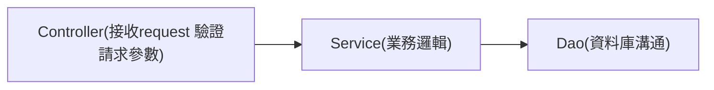

# spring-boot-practice
practice spring boot

Hawhow 課程筆記，順便練習MD

[TOC]


## Component

> * 如果沒有額外設定scope，預設皆為`singleton`
> * 只要有繼承`@Component`，都會被spring產生實例放入bean map
> * spring會針對有`@Autowired`的「Property」或「Method」，並從bean map找出相對應的bean並放入
> * 如果同一個介面有兩個實作程式，需再加上`@Qualifier`，加上value設定指向某一個實作

```java
public interface Printer {
  String info();
}

@Component("hp")
public class HPPrinter implements Printer {
  @Override
  public String info() { return "hp"; }
}
@Component("sharp")
public class SharpPrinter implements Printer {
  @Override
  public String info() { return "sharp"; }
}
@Component
public class Controller {
  @Autowired
  @Qualifier("hp")
  private Printer hp;
  
  @Autowired
  @Qualifier("sharp")
  private Printer sharp;
}
```


## Spring JDBC

>* 以SQL為主
>* 需自己寫SQL操作資料庫

1. `build.gradle` 的 dependencies加上**spring-boot-starter-jdbc**、依連線的DB類型加上Driver

```groovy
dependencies {
	implementation 'org.springframework.boot:spring-boot-starter-jdbc'
  
  // https://mvnrepository.com/artifact/mysql/mysql-connector-java
	implementation group: 'mysql', name: 'mysql-connector-java', version: '8.0.22'
}
```

2. `application.properties`加上DB連線資訊，**spring.datasource.url**後段可加上serverTimezone(時區)、characterEncoding(編碼)

```properties
spring.datasource.driver-class-name = com.mysql.cj.jdbc.Driver
spring.datasource.url = jdbc:mysql://localhost:3306/myjdbc?serverTimezone=Asia/Taipei&characterEncoding=utf-8
spring.datasource.username = root
spring.datasource.password = springboot
```

3. 使用spingjdbc 預設的bean `NamedParameterJdbcTemplate`座資料庫連線操作update、insert、delete、select等sql指令

   ```java
   @RestController
   @RequestMapping("/student")
   public class StudentController {
     @Autowired
     private NamedParameterJdbcTemplate namedParameterJdbcTemplate;
   }
   ```

   

   3.1 `insert`

   ```java
   @PostMapping
   public String insert(@RequestBody Student student) {
     Map<String, Object> map = new HashMap<>();
     map.put("name", student.getName());
     KeyHolder keyHolder = new GeneratedKeyHolder();
     String sql = "INSERT INTO student(name) value (:name)";
     namedParameterJdbcTemplate.update(sql, new MapSqlParameterSource(map), keyHolder);
     return "Student " + student.getName() + " id is " + keyHolder.getKey().intValue();
   }
   ```

   3.2 `delete`

   ```java
   @DeleteMapping("/{studentId}")
   public String delete(@PathVariable Integer studentId) {
     Map<String, Object> map = new HashMap<>();
     map.put("id", studentId);
     namedParameterJdbcTemplate.update("DELETE FROM student WHERE id = :id", map);
     return "Student id " + studentId + " is delete";
   }
   ```

   3.3 `update`

   ```java
   @PutMapping
   public String update(@RequestBody Student student) {
     Map<String, Object> map = new HashMap<>();
     map.put("id", student.getId());
     map.put("name", student.getName());
     namedParameterJdbcTemplate.update("UPDATE student SET name = :name WHERE id = :id", map);
     return "Student id " + student.getId() + " name has change to " + student.getName();
   }
   ```

   3.4 `select`

   ```java
   @GetMapping("/{studentId}")
   public Student select(@PathVariable Integer studentId) {
     Map<String, Object> map = new HashMap<>();
     String sql = "SELECT id, name FROM student WHERE id = :id";
     map.put("id", studentId);
   
     return namedParameterJdbcTemplate.query(sql, map, rs -> {
       if (rs.next()) {
         Student student = new Student();
         student.setId(rs.getInt("id"));
         student.setName(rs.getString("name"));
         return student;
       } else {
         return null;
       }
     });
   }
   ```
   
   

### MVC



### Transation

> * 一個交易包含多個資料庫操作，為了令資料達到一制性需一起成功或一起失敗。
>   * 於Spring中可使用`@Transational` annotation管理資料庫操作，可加註於method或class

### 多個資料庫連線設定

```properties
spring.datasource.test1.driver-class-name=com.mysql.cj.jdbc.Driver
spring.datasource.test1.jdbc-url=jdbc:mysql://localhost:3306/test1?serverTimezone=Asia/Taipei&characterEncoding=utf-8
spring.datasource.test1.username=root
spring.datasource.test1.password=springboot

spring.datasource.myjdbc.driver-class-name = com.mysql.cj.jdbc.Driver
spring.datasource.myjdbc.jdbc-url = jdbc:mysql://localhost:3306/myjdbc?serverTimezone=Asia/Taipei&characterEncoding=utf-8
spring.datasource.myjdbc.username = root
spring.datasource.myjdbc.password = springboot
```

```java
...
@Bean
@ConfigurationProperties(prefix = "spring.datasource.test1")
public DataSource test1DataSource() {
    return DataSourceBuilder.create().build();
}

@Bean
public NamedParameterJdbcTemplate test1JdbcTemplate(
  @Qualifier("test1DataSource") DataSource dataSource) {
    return new NamedParameterJdbcTemplate(dataSource);
}

@Bean
@ConfigurationProperties(prefix = "spring.datasource.myjdbc")
public DataSource myjdbcDataSource() {
    return DataSourceBuilder.create().build();
}

@Bean
public NamedParameterJdbcTemplate myJdbcJdbcTemplate(
        @Qualifier("myjdbcDataSource") DataSource dataSource) {
    return new NamedParameterJdbcTemplate(dataSource);
}
...
```

## Spring Data JPA

> * 以JAVA Object為主
> * 由ORM框架產生SQL操作資料庫
> * 較難寫出複雜的查詢邏輯

>* JPA - Java Persistence API
    * 提供多種annotation註解使用，如@Entity，＠Table，@Column
>* Hibernate - ORM框架，實作JPA
    * 自動生成SQL語法

1. `build.gradle` 的 dependencies加上**spring-boot-starter-data-jpa**，Driver已於JDBC加上

```groovy
dependencies {
	implementation 'org.springframework.boot:spring-boot-starter-data-jpa'
}
```

2. DB連線資訊如JDBC設定
3. 設定Student Entity

```java
@Entity
@Table(name = "student")
public class Student {
   
  @Id
  @GeneratedValue(strategy = GenerationType.IDENTITY)
  @Column(name = "id")
  private Integer id;
   
  @Column(name = "name")
  private String name;
     
  // getter setter method
}
```

4. 建立繼承CrudRepository的StudentRepository

```java
public interface StudentRepository extends CrudRepository<Student, Integer> {}
```

5. 於Controller使用StudentRepository Bean

```java
public class StudentController {
  @Autowired
  private StudentRepository studentRepository;
  
  @PostMapping
  public String insert(@RequestBody Student student) {
    studentRepository.save(student);
    return "執行Create操作";
  }
}
```

   ### 多個資料庫連線設定

```java
@EnableTransactionManagement
@EnableJpaRepositories(entityManagerFactoryRef = "myJdbcEntityManagerFactory",
        transactionManagerRef = "myJdbcTransactionManager",
        basePackages = "com.siang.springboot.practice.springbootpractice.database.myjdbc.repository")
@Configuration
public class MyJdbcDataSourceConfig {

    @Primary // 配置多個資料庫時，一定要有一個掛上此annotation，判別預設的db
    @Bean
    @ConfigurationProperties(prefix = "spring.datasource.myjdbc")
    public DataSource myjdbcDataSource() {
        return DataSourceBuilder.create().build();
    }

    @Bean
    public NamedParameterJdbcTemplate myJdbcJdbcTemplate(
            @Qualifier("myjdbcDataSource") DataSource dataSource) {
        return new NamedParameterJdbcTemplate(dataSource);
    }

    @Primary
    @Bean
    public LocalContainerEntityManagerFactoryBean myJdbcEntityManagerFactory(
            EntityManagerFactoryBuilder builder,
            @Qualifier("myjdbcDataSource") DataSource dataSource) {
        return builder.dataSource(dataSource)
                .packages("com.siang.springboot.practice.springbootpractice.database.myjdbc.entity")
                .persistenceUnit("myJdbc").build();
    }

    @Primary
    @Bean
    public PlatformTransactionManager myJdbcTransactionManager(
            @Qualifier("myJdbcEntityManagerFactory") EntityManagerFactory entityManagerFactory) {
        return new JpaTransactionManager(entityManagerFactory);
    }
}
```

### `@Query` annotation

> * 可以寫出較複雜的查詢

```java
public interface StudentRepository extends CrudRepository<Student, Integer> {
    /**
     * 可以直接帶入參數不需任何annotation，parameter的命名需與Student field Name相同
     */
    List<Student> findByName(String name);
    Student findByIdAndName(Integer id, String name);

    /**
     * 使用Query annotation 建立查詢的SQL，?接的數字為parameter的位置
     * 使用JPQL語法查詢
     */
    @Query("SELECT s FROM Student s WHERE s.sex = ?1")
    List<Student> findBySex(String sex);
  
    /**
     * nativeQuery = false, 可以以原始的sql查詢
     */
    @Query("SELECT * FROM Student WHERE sex = ?1", nativeQuery = false)
    List<Student> findBySex(String sex);
}
```


See [菜鳥工程師：肉豬](https://matthung0807.blogspot.com/2019/09/spring-data-jpa-multiple-datasource.html).

