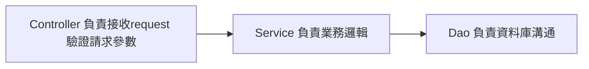

# spring-boot-practice
practice spring boot

Hawhow 課程筆記，順便練習MD

[TOC]


## CH5 - Spring JDBC

>* 以SQL為主
>* 需自己寫SQL操作資料庫

1. `build.gradle` 的 dependencies加上**spring-boot-starter-jdbc**、依連線的DB類型加上Driver

```groovy
dependencies {
	implementation 'org.springframework.boot:spring-boot-starter-jdbc'
  
  // https://mvnrepository.com/artifact/mysql/mysql-connector-java
	implementation group: 'mysql', name: 'mysql-connector-java', version: '8.0.22'
}
```

2. `application.properties`加上DB連線資訊，**spring.datasource.url**後段可加上serverTimezone(時區)、characterEncoding(編碼)

```properties
spring.datasource.driver-class-name = com.mysql.cj.jdbc.Driver
spring.datasource.url = jdbc:mysql://localhost:3306/myjdbc?serverTimezone=Asia/Taipei&characterEncoding=utf-8
spring.datasource.username = root
spring.datasource.password = springboot
```

3. 使用spingjdbc 預設的bean `NamedParameterJdbcTemplate`座資料庫連線操作update、insert、delete、select等sql指令

   ```java
   @RestController
   @RequestMapping("/student")
   public class StudentController {
     @Autowired
     private NamedParameterJdbcTemplate namedParameterJdbcTemplate;
   }
   ```

   

   3.1 `insert`

   ```java
   @PostMapping
   public String insert(@RequestBody Student student) {
     Map<String, Object> map = new HashMap<>();
     map.put("name", student.getName());
     KeyHolder keyHolder = new GeneratedKeyHolder();
     String sql = "INSERT INTO student(name) value (:name)";
     namedParameterJdbcTemplate.update(sql, new MapSqlParameterSource(map), keyHolder);
     return "Student " + student.getName() + " id is " + keyHolder.getKey().intValue();
   }
   ```

   3.2 `delete`

   ```java
   @DeleteMapping("/{studentId}")
   public String delete(@PathVariable Integer studentId) {
     Map<String, Object> map = new HashMap<>();
     map.put("id", studentId);
     namedParameterJdbcTemplate.update("DELETE FROM student WHERE id = :id", map);
     return "Student id " + studentId + " is delete";
   }
   ```

   3.3 `update`

   ```java
   @PutMapping
   public String update(@RequestBody Student student) {
     Map<String, Object> map = new HashMap<>();
     map.put("id", student.getId());
     map.put("name", student.getName());
     namedParameterJdbcTemplate.update("UPDATE student SET name = :name WHERE id = :id", map);
     return "Student id " + student.getId() + " name has change to " + student.getName();
   }
   ```

   3.4 `select`

   ```java
   @GetMapping("/{studentId}")
   public Student select(@PathVariable Integer studentId) {
     Map<String, Object> map = new HashMap<>();
     String sql = "SELECT id, name FROM student WHERE id = :id";
     map.put("id", studentId);
   
     return namedParameterJdbcTemplate.query(sql, map, rs -> {
       if (rs.next()) {
         Student student = new Student();
         student.setId(rs.getInt("id"));
         student.setName(rs.getString("name"));
         return student;
       } else {
         return null;
       }
     });
   }
   ```
   
   

### MVC



## CH6 - Spring Data JPA

> * 以JAVA Object為主
> * 由ORM框架產生SQL操作資料庫
> * 較難寫出複雜的查詢邏輯

>* JPA - Java Persistence API
    * 提供多種annotation註解使用，如@Entity，＠Table，@Column
>* Hibernate - ORM框架，實作JPA
    * 自動生成SQL語法

1. `build.gradle` 的 dependencies加上**spring-boot-starter-data-jpa**，Driver已於JDBC加上

```groovy
dependencies {
	implementation 'org.springframework.boot:spring-boot-starter-data-jpa'
}
```

2. DB連線資訊如JDBC設定
3. 設定Student Entity

```java
@Entity
@Table(name = "student")
public class Student {
   
  @Id
  @GeneratedValue(strategy = GenerationType.IDENTITY)
  @Column(name = "id")
  private Integer id;
   
  @Column(name = "name")
  private String name;
     
  // getter setter method
}
```

4. 建立繼承CrudRepository的StudentRepository

```java
public interface StudentRepository extends CrudRepository<Student, Integer> {}
```

5. 於Controller使用StudentRepository Bean

```java
public class StudentController {
  @Autowired
  private StudentRepository studentRepository;
  
  @PostMapping
  public String insert(@RequestBody Student student) {
    studentRepository.save(student);
    return "執行Create操作";
  }
}
```

   

